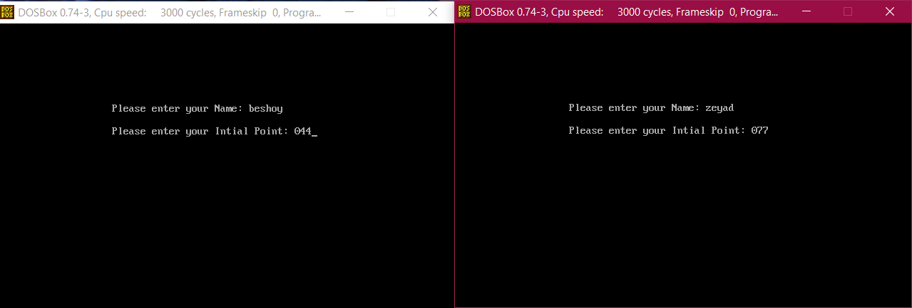
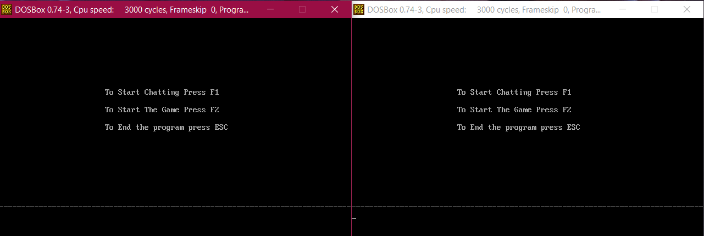
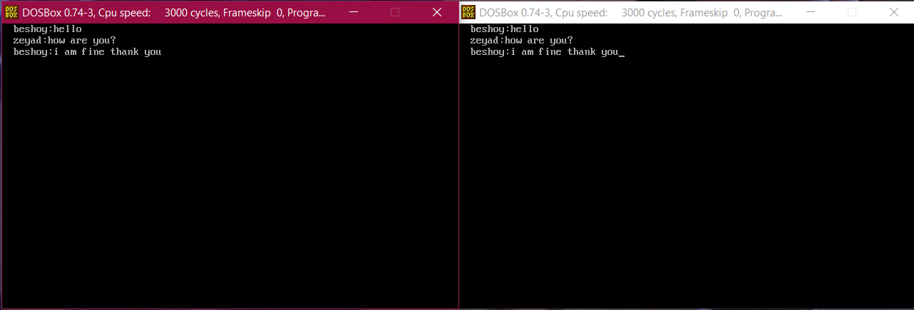
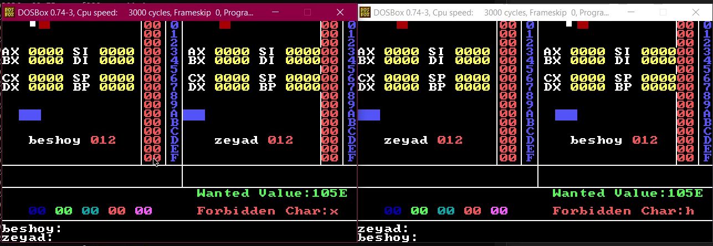
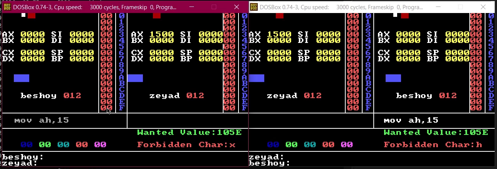
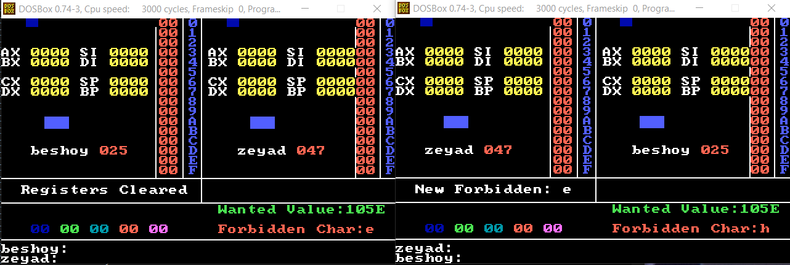
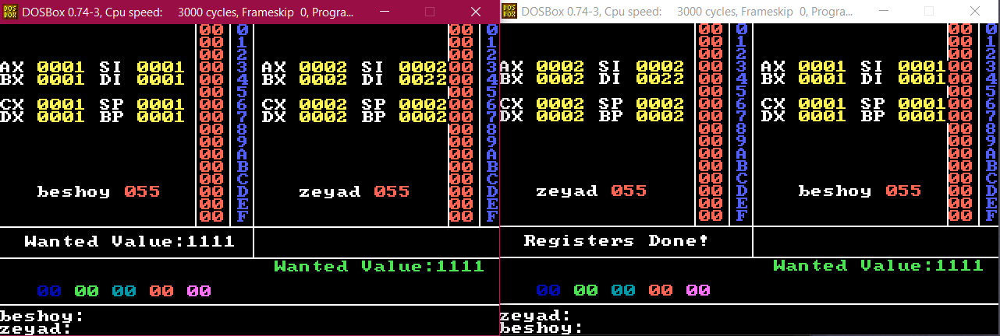
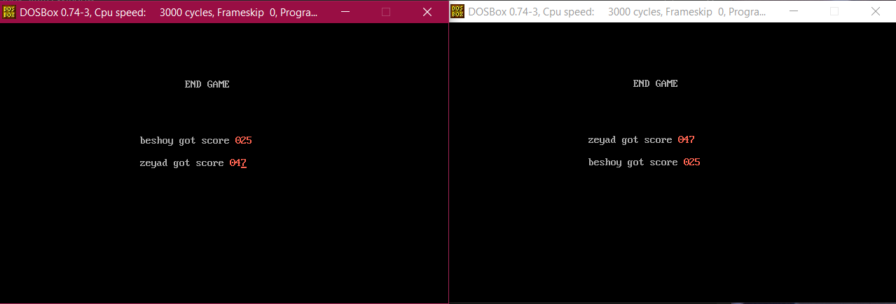

<div align="center" >
  <a href="https://github.com/ZeyadTarekk/The86-Pgame" rel="noopener">


  </a>
</div>
<div align="center">

[](https://github.com/ZeyadTarekk/The86-Pgame/contributors)
[](https://github.com/ZeyadTarekk/The86-Pgame/issues)
[](https://github.com/ZeyadTarekk/The86-Pgame/blob/master/LICENSE)
[](https://github.com/ZeyadTarekk/The86-Pgame/network)
[](https://github.com/ZeyadTarekk/The86-Pgame/stargazers)
[](https://github.com/ZeyadTarekk/The86-Pgame)

</div>

# 📝 Tables of Contents

- [Tables of Contents](#tables-of-contents)
- [The86-Pgame](#The86-Pgame)
- [How to run?](#how-to-run)
- [Game rules](#game-rules)
- [Screenshots](#screenshots)
  - [Name screen](#name-screen)
  - [Main Menu](#main-menu)
  - [Chat Menu](#chat-menu)
  - [Game start](#game-start)
  - [Midgame](#midgame)
  - [Powerups](#powerups)
  - [Game end](#game-end)
- [Single PC version](#single-pc-version)
- [Contributors](#contributors)
- [License](#license)

# 📙 The86-Pgame

The86-Pgame is a two-player competitive game coded in **X86 assembly** aimed for multiplayers via serial communication ports.

# 🏁 How to run?

To run the game you need a DOS emulator, you can use [DOSBOX](https://www.dosbox.com/)

1. Start by installing DOSBOX
2. Connect two PCs using a Serial COM port or use [Virtual Serial Port Driver](https://www.virtual-serial-port.org/) to simulate two PCs
   - You can find a tutorial on connecting virtual serial port to DOSBOX [here](https://www.youtube.com/watch?v=xIyldfZGNAQ)
3. Start the game on each device

   - ```sh
     $ git clone https://github.com/ZeyadTarekk/The86-Pgame.git
     ```
   - ```sh
     $ cd The86-Pgame
     ```
   - ```sh
     $ masm MAIN.ASM
     ```
   - ```sh
     $ link MAIN.OBJ
     ```
   - ```sh
     $ MAIN.EXE
     ```

4. Press F1 to send a chat invite or accept one, or F2 to send a game invite or accept one.

# 📱 Game rules

- Start by entering the forbidden character for your opponent.
  - In level 1 your opponent can see the forbidden character you chose for him but in level 2 he can't see it.
  - In level 1 your opponent can't type any command that contains the forbidden character but in level 2 he will type it normally but it won't execute so he starts guessing it.
- You execute Assembly commands on your opponent processor and your opponent executes Assembly commands on your processor.
- If anyone types a wrong command his points will decrease by one
  - Types of Errors Detected:
  1. Size Mismatch
  2. Memory to memory operation
  3. Incorrect addressing mode
  4. Invalid register name
- Whenever you succeed to put the wanted value in any of your opponent's registers you WON!.
- Shooting game appears randomly in the middle of the game to both players at the same time and one player only can shoot the target and each target color has some points given to the player.
- These points will provide you with a powerup that you can use with number keys 1 through 5.
  - The available powerups are:
    1. Executing acommand on your own processor. (consumes 5 points)
    2. Executing a command on your processor and your opponent processor at the same time. (consumes 3 points)
    3. Changing the forbidden character. (only once for each player, consumes 8 points)
    4. Clearing all registers at once. (only once for each player, Consumes 30 points)
    5. An extra power up is introduced, letting each player be able to change the target value to any value other than values currently existing in any register for the two players. (For Level 2, only once for each player)

# 📷 Screenshots

## Name screen



## Main Menu



## Chat Menu



## Game start



## Midgame



## Powerups




## Game end



# Single PC version

You can find a multiplayer version that runs on only one PC instead through [this commit](https://github.com/ZeyadTarekk/The86-Pgame/tree/800e80c6c5c2d9a6c2e38570a385eb96d9b0efc7).

The controls are WASD for one player and arrows for the other.

# Contributors

<table>
  <tr>
    <td align="center">
    <a href="https://github.com/ZeyadTarekk" target="_black">
    
    <br />
    <sub><b>Zeyad Tarek</b></sub></a>
    </td>
    <td align="center">
    <a href="https://github.com/Abd-ELrahmanHamza" target="_black">
    
    <br />
    <sub><b>Abdelrahman Mohamed</b></sub></a>
    </td>
    <td align="center">
    <a href="https://github.com/BeshoyMorad" target="_black">
    
    <br />
    <sub><b>Beshoy Morad</b></sub></a>
    </td>
    <td align="center">
    <a href="https://github.com/ZiadSheriif" target="_black">
    
    <br />
    <sub><b>Ziad Sherif</b></sub></a>
    </td>
    
    
  </tr>
 </table>

# License

> This software is licensed under MIT License, See [License](https://github.com/ZeyadTarekk/The86-Pgame/blob/main/LICENSE) for more information ©ZeyadTarekk.
